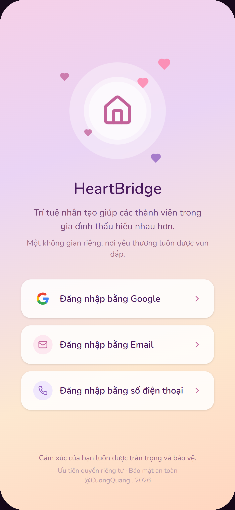
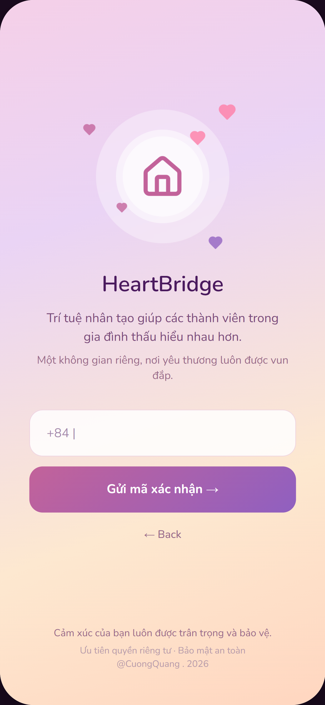
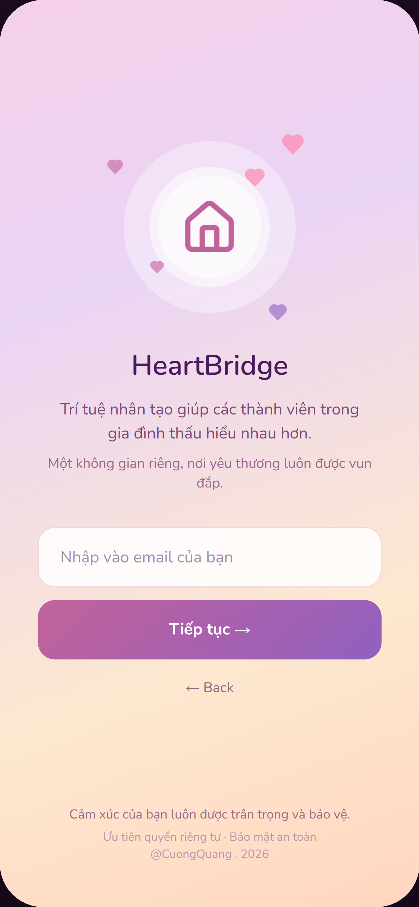
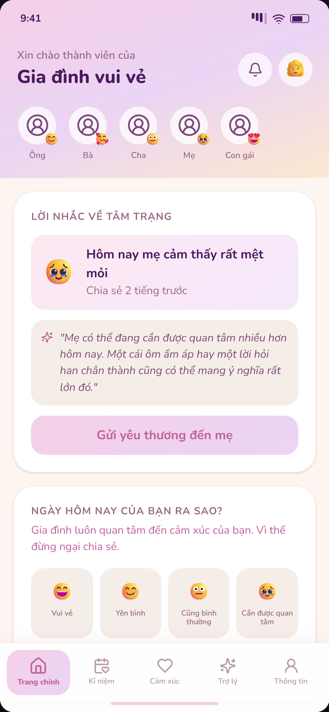
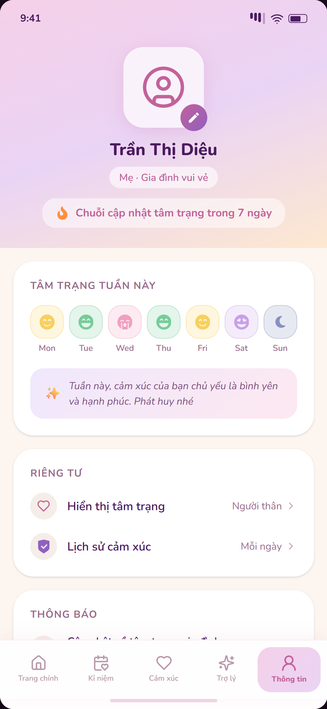
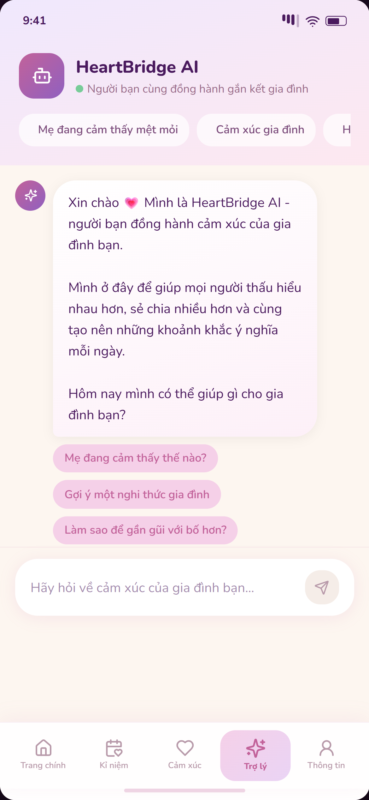
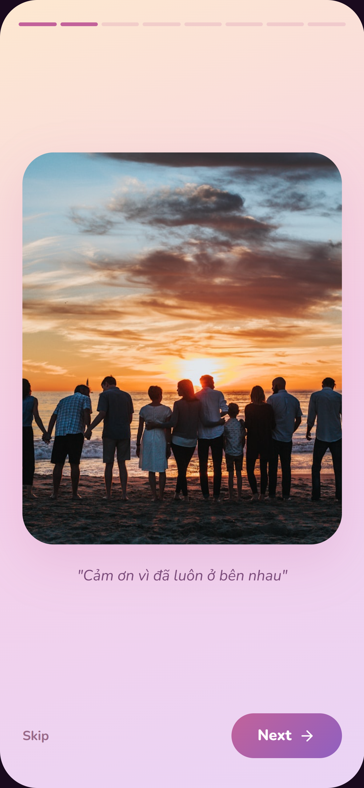
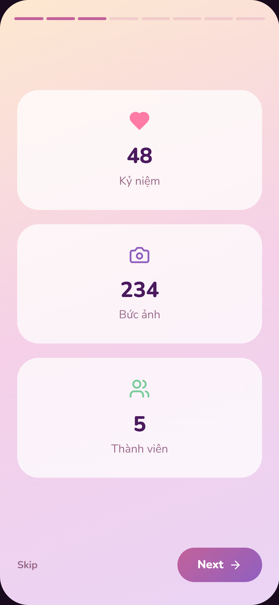
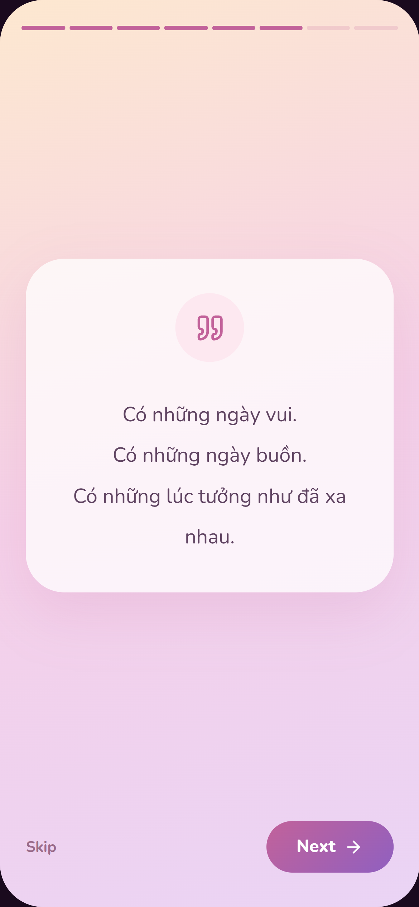

# HeartBridge 

> **HeartBridge** là ứng dụng di động hỗ trợ gắn kết gia đình bằng AI, giúp các thành viên thấu hiểu cảm xúc, lưu giữ những khoảnh khắc đáng nhớ và xây dựng sự kết nối bền vững hơn.

## Tại sao tôi xây dựng HeartBridge?

Trong cuộc sống hiện đại, mỗi thành viên trong gia đình đều có công việc, học tập và những áp lực riêng.

Nhiều khi chúng ta sống cùng một mái nhà nhưng lại ít có cơ hội chia sẻ cảm xúc, ít hiểu nhau hơn và dần mất đi những khoảnh khắc ý nghĩa.

Tôi xây dựng **HeartBridge** với mong muốn:

* Giúp các thành viên hiểu cảm xúc của nhau hơn.
* Lưu giữ những kỷ niệm đẹp của gia đình.
* Sử dụng AI như một người bạn đồng hành để lắng nghe và hỗ trợ.
* Tạo ra một không gian riêng tư, an toàn và ấm áp dành cho gia đình.

> *"Gia đình không cần hoàn hảo, chỉ cần luôn ở bên nhau."*

## Tính năng chính

### Home

* Hiển thị tổng quan gia đình
* Hoạt động gần đây
* Gợi ý hoạt động gắn kết
* Truy cập nhanh các tính năng

### Mood Tracking

* Chia sẻ tâm trạng hằng ngày
* Theo dõi cảm xúc theo thời gian
* AI phân tích và đưa ra lời khuyên

### Family Calendar

* Sinh nhật
* Sự kiện quan trọng
* Hoạt động chung
* Nhắc nhở

### Memories

* Lưu giữ hình ảnh
* Video kỷ niệm
* Timeline ký ức
* Phân loại theo chủ đề

### Year Recap

* Tổng hợp những khoảnh khắc nổi bật trong năm
* Hiệu ứng Story giống Instagram
* Chuyển cảnh mượt mà
* Mang lại trải nghiệm cảm xúc và gần gũi

### AI Care

* AI trò chuyện
* Gợi ý hoạt động gia đình
* Hỗ trợ cảm xúc
* Đưa ra lời khuyên phù hợp

## Thiết kế

HeartBridge được thiết kế theo phong cách:

🩷 Pastel Color Palette

🫧 Glassmorphism nhẹ

📱 Mobile First

🎞 Story Style Animation

🌸 Tập trung vào cảm xúc và sự gần gũi

🤍 Bo góc lớn, giao diện mềm mại

---

## Mục tiêu dự án

HeartBridge không chỉ là một ứng dụng lưu giữ kỷ niệm.

Tôi mong muốn tạo ra một sản phẩm giúp:

* Gia đình hiểu nhau hơn.
* Mọi người quan tâm nhau nhiều hơn.
* Những khoảnh khắc nhỏ được lưu giữ lâu dài.
* AI trở thành công cụ kết nối cảm xúc thay vì thay thế con người.

---

<h3 align="center">Login Screen</h3>

  
  
  

<h3 align="center">Home Screen</h3>

  
  
  

<h3 align="center">Year Recap</h3>

  
  
  

---

## Công nghệ sử dụng

## Dự kiến bổ sung

---

## Tác giả

**Quang Cường**

Sinh viên Công nghệ Thông tin tại UTH.

---

**HeartBridge ❤️**

*Connecting hearts, preserving memories.*

